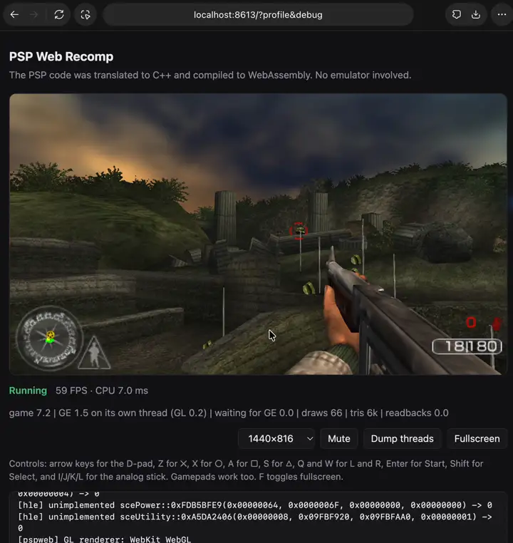

# Call of Duty: Roads to Victory Web Recomp

Call of Duty: Roads to Victory running in the browser without an emulator. The game MIPS machine code is translated ahead of time into C++, compiled to WebAssembly, and linked against a small reimplementation of the PSP's operating system and graphics chip that draws with WebGL2.

This project builds on [PSP Web Recomp by Samir Nuri (snuri00)](https://github.com/snuri00/psp-web-recomp). It adds Call of Duty: Roads to Victory support, system fonts, scheduling and graphics fixes, and keyboard and gamepad control improvements.

<p align="center">
  
  <br>
  <a href="docs/media/call-of-duty-demo.mp4">Watch the full recording (1:16)</a>
</p>

## How it works
**Recompilation.** [PSPRecomp](https://github.com/jessicanataliagta/PSPRecomp) analyses the decrypted executable, finds its functions and emits C++ for them in translation units of 16 KiB of guest code each. That code runs against a register file and a model of the PSP's memory. This project adds a handful of fixes to PSPRecomp (in `patches/`) and a new target for it, the web profile in `profile/`.

**A small PSP kernel.** Whatever the game asks of the PSP's operating system is answered by high-level emulation in `profile/host`: cooperative threads with semaphores, event flags and callbacks, memory partitions, the file system (with disc data streamed over HTTP Range requests, so only the executable is downloaded up front), the controller, audio output, the save data and message dialogs, and the movie player's bookkeeping. Guest time advances in frames, so a game sees a steady 60 Hz however fast the host runs.

**Graphics.** The GE, the PSP's graphics chip, is fed display lists. `ge.cpp` decodes them on the CPU, including vertex formats, skinning, lighting, texture generation, clipping and backface culling, and hands batched triangles and render state to `ge_gl.cpp`. There, framebuffers become WebGL render targets keyed by their place in VRAM, so effects that render to a texture and read it back stay on the GPU. Pixel format reinterpretation (games read 32-bit buffers as 16-bit textures and back), the PSP's stencil-in-alpha, fog and block transfers are emulated on the GPU as well, and everything can render at one to four times the native 480×272.

**Two threads, like the PSP.** On the PSP the graphics chip works through one frame's display list while the CPU prepares the next, and games are written around that. Here the GE and its WebGL context run on a worker thread with an OffscreenCanvas: queuing a list returns at once and only the explicit sync calls wait. A frame costs whichever thread is busier rather than the sum of both.

**Sound.** Sound effects come from a reimplementation of the PSP's voice synthesizer (32 voices of ADPCM with pitch and ADSR envelopes), music and speech from ATRAC3+ streams decoded with the FFmpeg decoder, and the mix goes to an AudioWorklet.

## Changes in this version

Call of Duty: Roads to Victory (USA, multilingual) has been built and checked on Apple Silicon macOS through the `port.sh` pipeline, reaching the main menu, campaign selection, mission briefings and the gameplay shown in the demo above.

The recompiler now supports VFPU integer packing (`vi2uc`, `vi2c`, `vi2us`, `vi2s`) and packed color conversions (`vt4444`, `vt5551`, `vt5650`). Tight local loops yield back to the scheduler, and threads at the same priority get time to run, so a game polling for an I/O result can let the worker finish it.

The graphics path handles GE synchronization barriers and FINISH callbacks, and the kernel delivers vertical-blank subinterrupts with the guest's register context preserved. Additional system calls cover nonblocking fixed-pool allocation, UMD readiness, RTC ticks, savedata size queries and the movie player's YCbCr bookkeeping.

The game also builds vertex conversion routines in RAM. `scripts/precompile_dynamic.py` runs the translated builders during the build, generates 960 format combinations for each of the two converters and compiles their 1,914 unique routines ahead of time. This extra pass is selected by the tested executable's SHA-256; it is specific to that version of the game.

**System fonts.** Games importing `sceLibFont` can use original PGF fonts through `profile/host/font.cpp`. The build converts their glyph metrics and pixels into a cache, bundles it with the executable and synchronizes glyph texture writes with the GE worker. Call of Duty's bundled firmware updater supplies the Japanese and Latin fonts used here.

**Controls.** Blocking controller reads wait for a fresh sample instead of returning the same button state repeatedly within one frame. The browser clears held keys when it loses focus and supports standard gamepad triggers. Call of Duty defaults to the FPS layout: WASD moves, I/J/K/L looks, V fires, Q aims, R reloads, E interacts, C crouches, Space jumps, 1 switches weapons and Esc pauses. Enter or Z accepts menus, X goes back and arrows navigate. On a gamepad, the left stick moves, the right stick maps to the PSP face buttons for aiming, and the triggers aim and fire. The control selector also offers the original PSP bindings.

Regression tests cover controller sampling and release, thread scheduling, graphics callbacks and barriers, interrupt masking, font metrics and pixels, RAM vertex converters and VFPU packing. [docs/internals.md](docs/internals.md) has the test commands and debugging tools. Movies are still skipped, and the savedata additions currently cover storage size queries rather than persistent save/load.

## Port a game of your own

Use a PSP disc image: an ISO, a ZIP containing an ISO, or an extracted disc folder containing `PSP_GAME`. You need git, CMake, Ninja, a C++20 compiler, Python 3 and make. The setup script installs the Emscripten SDK and builds PSPRecomp with this version's patches. Allow several gigabytes for the SDK, extracted disc, generated code and build files.

On macOS, install the Xcode command-line tools and, with Homebrew available, the build dependencies:

```bash
xcode-select --install
brew install git cmake ninja python openssl@3
```

On Debian or Ubuntu:

```bash
sudo apt update
sudo apt install git cmake ninja-build g++ python3 make libssl-dev
```

Clone [this fork](https://github.com/3Samourai/psp-web-recomp-call-of), then prepare the tools:

```bash
git clone https://github.com/3Samourai/psp-web-recomp-call-of.git
cd psp-web-recomp-call-of
scripts/setup.sh
```

**Decryption and fonts.** [John-K/pspdecrypt](https://github.com/John-K/pspdecrypt) can decrypt PSP executables and extract the firmware updater bundled with a disc. Call of Duty needs it for the system fonts. The following revision was used for this build:

```bash
git clone https://github.com/John-K/pspdecrypt.git tools/pspdecrypt
git -C tools/pspdecrypt checkout c156627db7634d395c380c0a9589130f603307fc
```

Build it on macOS using the Homebrew OpenSSL path:

```bash
openssl_prefix="$(brew --prefix openssl@3)"
make -C tools/pspdecrypt -j4 \
  CFLAGS="-O2 -I$openssl_prefix/include" \
  CXXFLAGS="-O2 -I$openssl_prefix/include" \
  EXTRA_FLAG="-L$openssl_prefix/lib"
```

On Debian or Ubuntu, the installed `libssl-dev` supplies the headers and libraries:

```bash
make -C tools/pspdecrypt -j4
```

**Build and run.** Pick a short folder name for the game and use the same name in both commands. Replace the ISO path with your own file:

```bash
scripts/port.sh mygame "/path/to/My Game.iso"
scripts/serve.sh mygame
```

Open [http://localhost:8613/](http://localhost:8613/) in a browser with WebGL2 support. Keep the server running while playing; Ctrl+C stops it. To use another port, run `scripts/serve.sh mygame 8614` and open `http://localhost:8614/`.

`port.sh` extracts the disc into `games/<name>/root/disc`, prepares the executable, translates its MIPS code into `profile/generated/<name>`, writes a streaming manifest, prepares any required system fonts and builds the page in `build/web-<name>/profiles/web/`. Running it again reuses the extracted disc and executable. Use a different folder name when building a different ROM or version. `--opt 1` is the default optimization level for generated code.

Some discs contain a plain ELF in `PSP_GAME/SYSDIR/BOOT.BIN`. The script uses that file automatically when no executable decrypter is configured. Call of Duty: Roads to Victory (USA) includes one, so its complete build uses:

```bash
scripts/port.sh cod-roads-to-victory "/path/to/Call of Duty - Roads to Victory (USA).iso"
scripts/serve.sh cod-roads-to-victory
```

For an encrypted executable without a plain `BOOT.BIN`, `PSP_DECRYPT` must name a tool accepting `tool <input> <output>`. John-K's utility instead takes an `-o` option, so create a small adapter once:

```bash
cat > tools/decrypt-eboot <<'SH'
#!/usr/bin/env bash
set -euo pipefail
tool_dir="$(cd "$(dirname "$0")" && pwd)"
exec "$tool_dir/pspdecrypt/pspdecrypt" -o "$2" "$1"
SH
chmod +x tools/decrypt-eboot

PSP_DECRYPT="$PWD/tools/decrypt-eboot" scripts/port.sh mygame "/path/to/My Game.iso"
scripts/serve.sh mygame
```

An executable that is already a plain ELF is copied directly. A decrypted executable dumped with PPSSPP can also be placed at `games/<name>/root/EBOOT.BIN` before running `port.sh`.

If the game imports `sceLibFont`, the font step uses `tools/pspdecrypt/pspdecrypt` to extract `PSP_GAME/SYSDIR/UPDATE/DATA.BIN` automatically. `PSP_PSAR_DECRYPT` can point to that utility elsewhere. If the disc has no bundled updater, point `PSP_FONT_DIR` at an original `flash0/font` folder with supported revision-2 PGF fonts:

```bash
PSP_FONT_DIR="/path/to/flash0/font" scripts/port.sh mygame "/path/to/My Game.iso"
```

For the optional headless native runner on Debian or Ubuntu, install `libegl-dev` and `libgles-dev`, then add `--native` to `port.sh`. It can dump rendered frames and record audio. The browser build does not need those native graphics libraries.

Other titles may need additional system calls or graphics features. The page log identifies missing calls as `[hle] unimplemented ...`, and the stopped status identifies execution failures. [docs/internals.md](docs/internals.md) explains how to inspect the guest threads, generated code and draws when bringing up another game.

## Hosting

The page uses SharedArrayBuffer for its threads, so it has to be served cross-origin isolated, with `Cross-Origin-Opener-Policy: same-origin` and `Cross-Origin-Embedder-Policy: require-corp`. `scripts/serve.py` sends both headers and supports the Range requests the disc streaming relies on. To try it on a phone, put a tunnel in front of it, for example `cloudflared tunnel --url http://127.0.0.1:8613`, which passes the headers through. Anyone with the address can load the game while the tunnel runs, so keep it to yourself and stop it when you are done.

Browsers that cannot draw WebGL2 on an OffscreenCanvas fall back to a single thread automatically; `?threads=0` forces that, and `?profile` adds a per-frame timing breakdown to the status bar.

## Legal

This repository contains only original code, the PSPRecomp patches and third-party code under its own license. It contains no game code or data. The generated C++ and the built WebAssembly are translations of the game's executable, so they belong to the game's owners: keep them on your own machine and do not publish them. Use disc images of games you own. This project is not affiliated with or endorsed by any game publisher.

## Credits

The original [PSP Web Recomp](https://github.com/snuri00/psp-web-recomp) by Samir Nuri (snuri00) provides the web profile, PSP kernel, WebGL2 renderer, audio integration and base build pipeline. This version extends that work with the Call of Duty bring-up and fixes described above.

PSPRecomp by its contributors (MIT) does the static recompilation. PPSSPP and JPCSP documented much of the hardware behavior emulated here, and PPSSPP's standalone copy of FFmpeg's ATRAC3/ATRAC3+ decoder is used for music and speech (LGPL 2.1 or later, in `profile/third_party/at3_standalone`). Emscripten builds the WebAssembly.

## License

The code in this repository is available under the MIT License, see [LICENSE](LICENSE). `profile/third_party/at3_standalone` keeps its LGPL 2.1 license.
